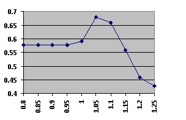

# Machine-learning-toolkit

Four supervised machine learning methods developed using java to learn a feature set and predict an unlabelled datasets classes.

The overall system is an ensemble learning system including the following components: KNN (K-Nearest Neighbours), NB (Naive Bayes), SVM (Support Vector Machine), RF (Random Forest).

### Pre-Processing:
There is minimal pre-processing as there is no priori knowledge about the data assumed.

The Random forest and decision tree methods require the data to be set to zero and one so there is a hard crossover point which allows for more efficient and effective feature splitting.

There is code which was commented out which scaled the features to the range 0-1 but it reduced generalisation and so was removed.

### Methods:
Here the methods used are described

#### K-Nearest Neighbours
My KNN classifier is trained simply by copying the training set into the classifier and then, when testing, finding the K-length set of the training instances which are the closest in Euclidean space to the test instance. Then returning the majority class of these neighbours as its evaluated class. This classifier has four parameters passed in at runtime: K, gistWeight, decision boundary and annotation confidence.
K is the size of the neighbours array, it determines how many nearby instances are evaluated to ascertain the instance in question’s class. gistWeight defines the bias given to the gist features when calculating the distance, decision boundary is an interesting one. The prior probability of any given instance belonging to class one is 0.5714, this means that there are more class one instances total than class zero instances, the result meaning that there will always be a bias in the neighbours array for class one instances. This means that when finding an instances class, we must take this under consideration and make it such that the same ratio of total class one to zeros in the neighbours array should produce a random assignment. The annotation confidence is used to bias instances based on how likely the given instances associated class is, a class one instance with confidence of 0.66 should have less weight than one with a confidence of 1.0.
#### Naive Bayes
The Naïve Bayes is trained by finding the mean and standard deviations of each feature across all training instances, ignoring any that are zero, and compiling them into a set of arrays. An instance is then tested by finding the probability of each feature in turn, summing up all probabilities accumulated through this manner and returning the class based on this total. The NB Classifier takes in only one parameter named: decWeight, which gives a bias to how much greater the positive probability needs to be than the negative probability for that feature to be classified as class one. In practice varying this parameter can increase the accuracy dramatically.
#### Support Vector Machine
The SVM classifier is trained through the use of a gradient hinge loss function applied to every feature on every training instance and then the each of those gradients are made to the respective feature of the weight vector. A testing instance is classified based on whether it is above or below the w vector, note that this is relative as the vector can paint the same path through a space but have a varying definition of what “up” is. I attempted to implement a kernel function, specifically Radial Based Function, but due to my implementation method I was unable to do so, the hinge loss function returns a value squared if a change needs to be made, this allows for features which are majorly misclassified to be reacted to faster than those which are only slightly miss classified. Takes in two parameters: learning rate and b, the learning rate determines how fast the SVM learns and should be set so it does not overstep, b determines the vector w’s offset from the origin.
#### Random Forest
The random forest classifier is trained by partitioning the training instance input into a pre-specified number of sets and then training a separate decision tree on each set. An instance is tested by polling each decision tree and finding the majority out of all of the polls. In this classifier I make use of binarisation to make hard decision boundaries for which path to take in any given node of a decision tree, a feature has its value set to one if it is above zero. This classifier takes in three parameters: decision tree boundary, decision tree number and the bias passed into each decision tree. The decision tree boundary is made use of when determining which child the instance is passed to during runtime, the decision tree number defines how many partitions and decision trees should be formed at runtime. The bias is given to the negative values when determining which child is the positive and which is the negative, meaning if the feature is positive which child will be used next.
### Results 
In order to determine what the optimal parameters were of each classifier I took each in turn and iterated over various values for each of their parameters. From here I got a multi-dimensional array of data which formed some sort of convex function, then it was a matter of repeatedly zoning in on the best parameters and combination which maximised this convex function. However, as I was implementing the classifiers myself, bugs existed for most of the time which varied the best parameters, this caused issues for finding what values worked most effectively. 
In my final iteration I had the parameters set at the following:

k = 30
gist weight = 1
decision boundary = 0.48
learning rate = 0.12
dev weight = 1.05
b = 1
decision tree boundary = 0.8
negative bias = 4
tree number = 5

An example of how the above values were calculated is as follows: First I would put the lower bound for the test values into the relevant for loop, inside of the main method of the Machine Learning class, I would then add the upper bound and step to that same loop. The parameter in the execute method call would be changed to the parameter variables name in the for loop, the program would then be run once for each value of the parameter in the for loop. The following is a graph depicting the output accuracy for each value between 0.8 and 1.25 with a step of 0.05 put into the Naïve Bayes implementation.

This shows how the accuracy peaks at 0.68 at a decision weighting of 1.05, next I would select a smaller sub set of the values from around this peak and repeat this process.
Along with implementing the classifiers I also created various file readers, writers and a program capable of automatically finding if the training and testing files are the same and then performing three-way cross validation on them. The program also can be set to detail the way in that the polling for the Ensemble Learning is carried out showing which classifiers voted for which instances which was an invaluable tool for finding flaws and strengths with each algorithm.
The average annotation confidence was 83.6%, meaning that only 83.6% of the instances should definitely be their specified class and even so some of those will be errors, so even with a perfect classifier you cannot expect even close to 100% accuracy on the test data given.
The reasoning behind choosing KNN, SVM and RF as my final Ensemble classifier was due to the effectiveness of these classifiers combined on the training data. KNN always worked very well getting ~71% accuracy in the training set as did SVM, once it was working to a satisfactory degree, then it was a choice between my NB or RF. I evaluated both classifiers with varying parameters and subsets of data (involved copying random instances from the training csv into a new file) and RF appeared to be working much better than NB. I realized afterwards however when checking that my code was correctly commented that this was due to my NB not reacting correctly to zero valued features, after it had been fixed it then was much better than the RF I had used, but I digress.
An issue with creating the entire project myself and repeatedly iterating upon it as I go, is that parameters were added and removed multiple times as they became either unnecessary or no longer needed. This made it difficult to re-enact earlier tests and made the process difficult, if I did this again there are many things which I would change, such as: having a standard interface for parameters, which would not change, writing out in pseudocode and dry running the algorithms prior to implementation and researching more about different varieties of classifiers. However, I am glad that I can say that I created the whole program myself and with my own research in many cases.  I am happy with my Kaggle result, of course I would want it to be higher, but I am still happy with it. 
Hindsight is both a wonderful and awful thing, I could have extended the functional use of the annotation confidence and prior probability to all of the classifiers in one way or another, for instance in SVM weighted the gradient based on the confidence or in Random Forest weight the node decisions by the annotation confidence of each instance checked.

### Free use
Feel free to download and look at the code, just bear in mind that this is not a geenral purpose solution as it was written for a specific project, all files should be there for it to work "out of the box".
